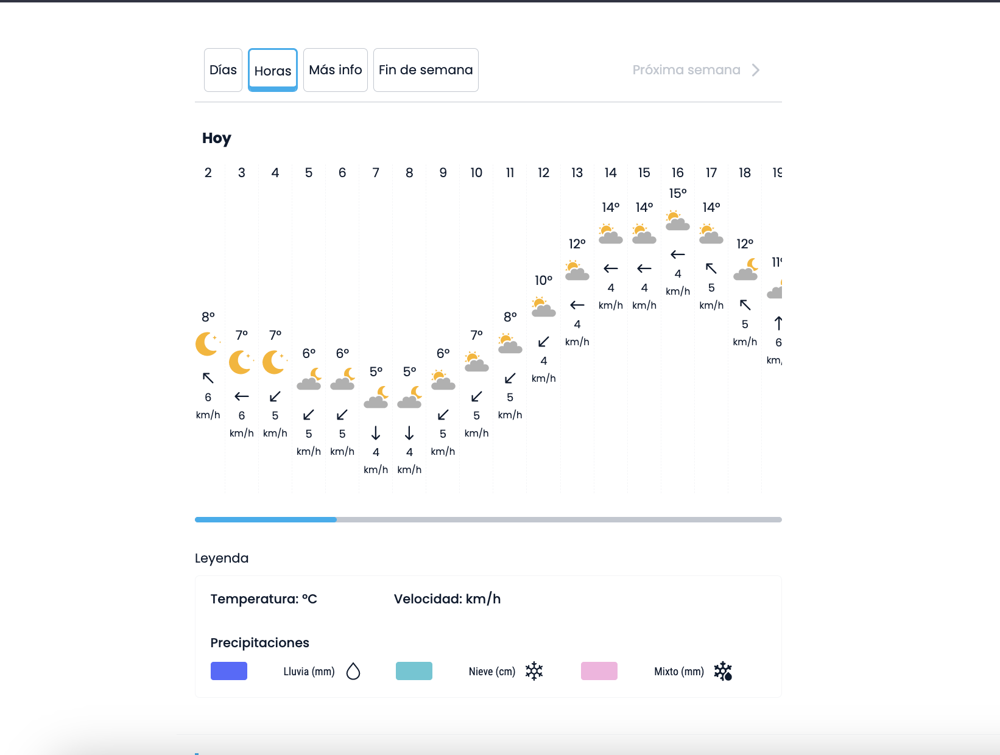

### ☀️ El tiempo
A simple script for scrap some data from [Eltiempo.es](http://eltiempo.es). It uses selenium.

### 📦 Installation
1. First, clone the repository:
```
git clone
```
2. Create and active a virtual environment:
```
python3 -m venv
source venv/bin/activate
```

3. Install dependencies:
```
pip install -r requirements.txt
```

### 🚀 Run
```
python3 main.py
```